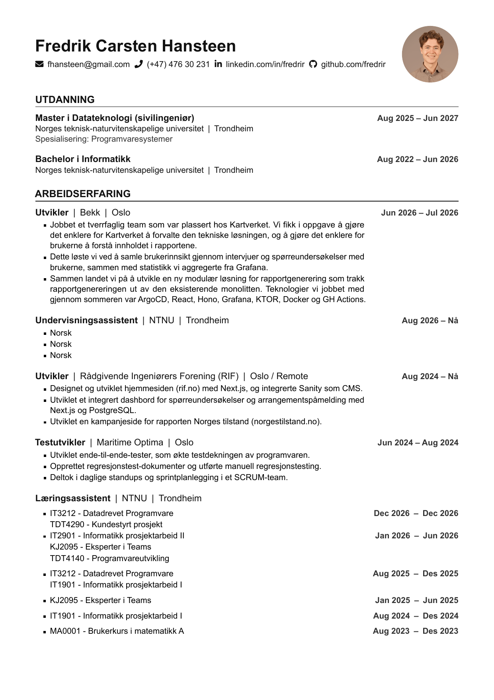
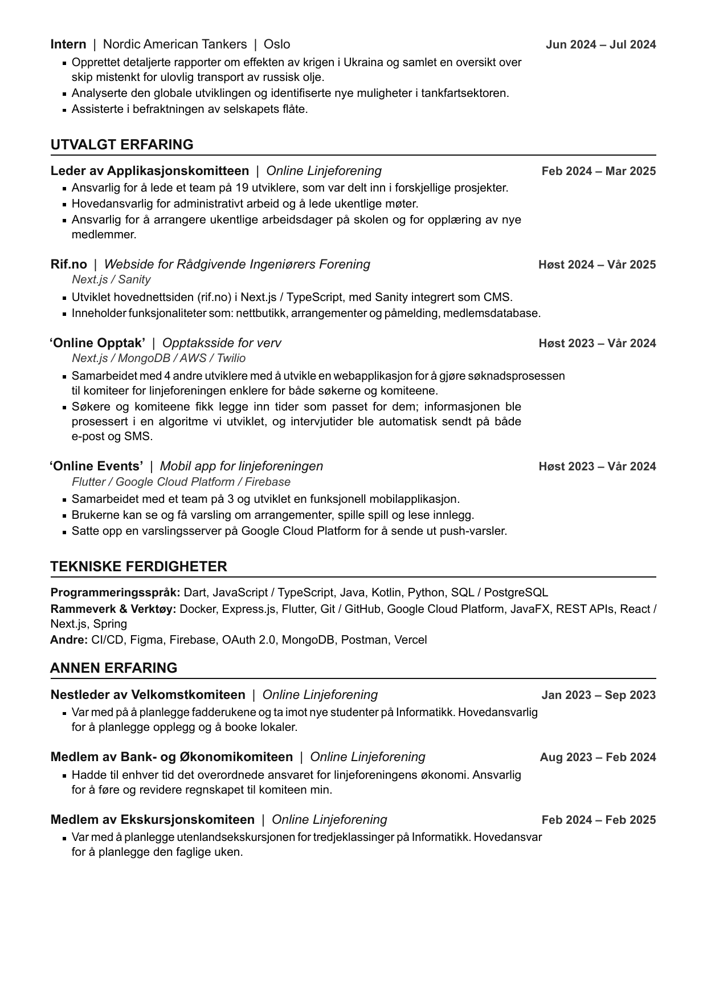

# CV

[](https://github.com/fredrir/CV/actions/workflows/preview.yml)
[](https://github.com/fredrir/CV/actions/workflows/checks.yml)
[](https://github.com/fredrir/CV/releases/latest)

LaTeX-kilde til CV-en min, tilgjengelig på norsk og engelsk.

## Forhåndsvisning

| Side 1 | Side 2 |
|:------:|:------:|
|  |  |

## Bygge PDF

CV-en bruker **lualatex**.

Via `build.sh` (gir korrekte PDF-navn):

```bash
bash build.sh       # bygger begge
bash build.sh en    # bare engelsk
bash build.sh nb    # bare norsk
bash build.sh clean # rydder opp
```


Resultatet legges som `CV_Fredrik_Carsten_Hansteen_En.pdf` / `CV_Fredrik_Carsten_Hansteen_Nb.pdf`.

De to inngangsfilene gjør bare to ting: setter `\cvlang` og inputter `main.tex`.

```
English.tex   ┐
Norsk.tex     ┴─►  main.tex  ─►  style/  +  content/
```

## Tospråklighet

Aktivt språk ligger i `\cvlang` (`en` eller `nb`).

Eksempel:

```latex
\cventry
  {\enor{Developer}{Utvikler}}
  {\enor{Council of Norwegian Consulting Engineers (RIF)}%
        {Rådgivende Ingeniørers Forening (RIF)}}
  {\enor{Oslo / Remote, Norway}{Oslo / Remote, Norge}}
  {Aug 2024 -- \lblpresent}
```

Samme fil produserer begge språk

## Flere roller samme sted

For en arbeidsgiver med flere roller, kombiner `\cventry` (tom `datoer`-argument) med `\cvsubentry`:

```latex
\cventry{Læringsassistent}{NTNU}{Trondheim, Norge}{}
\cvsubentry{Læringsassistent}{IT2901 - Informatikk prosjektarbeid II}
           {Januar 2025}{Juni 2025}
\cvsubentry{Læringsassistent}{KJ2095 - Eksperter i Teams}
           {Januar 2025}{Juni 2025}
```

## Fonter

CV-en bruker **Arial**. `style/fonts.sty` laster Arial direkte fra `fonts/`:

```
fonts/
├── ARIAL.TTF
├── ARIALBD.TTF
├── ARIALI.TTF
└── ARIALBI.TTF
```


## Avhengigheter

- TeX Live 2023+ (eller MiKTeX) med `lualatex`
- Pakker: `polyglossia`, `fontspec`, `geometry`, `tabularx`, `enumitem`,
  `tikz`, `hyperref`, `fancyhdr`, `graphicx`, `microtype`, `xcolor`,
  `etoolbox`, `needspace`, `lastpage`

## Release

- <https://github.com/fredrir/CV/releases/latest/download/CV_Fredrik_Carsten_Hansteen_En.pdf>
- <https://github.com/fredrir/CV/releases/latest/download/CV_Fredrik_Carsten_Hansteen_Nb.pdf>
